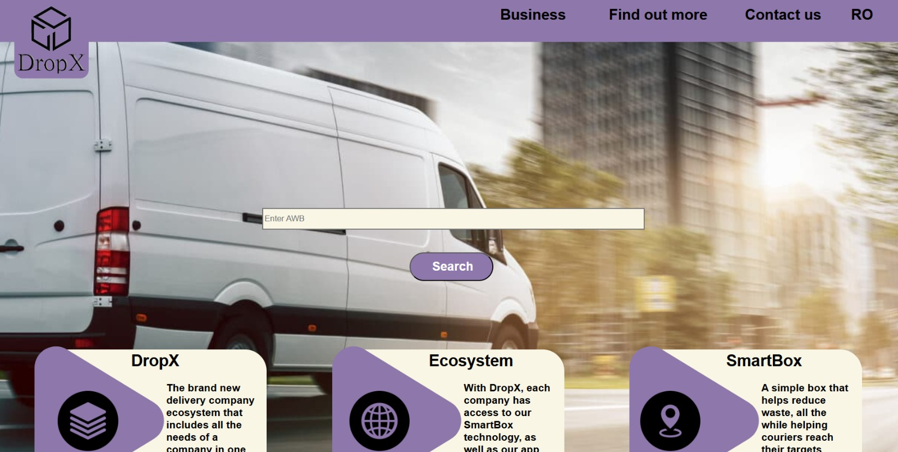
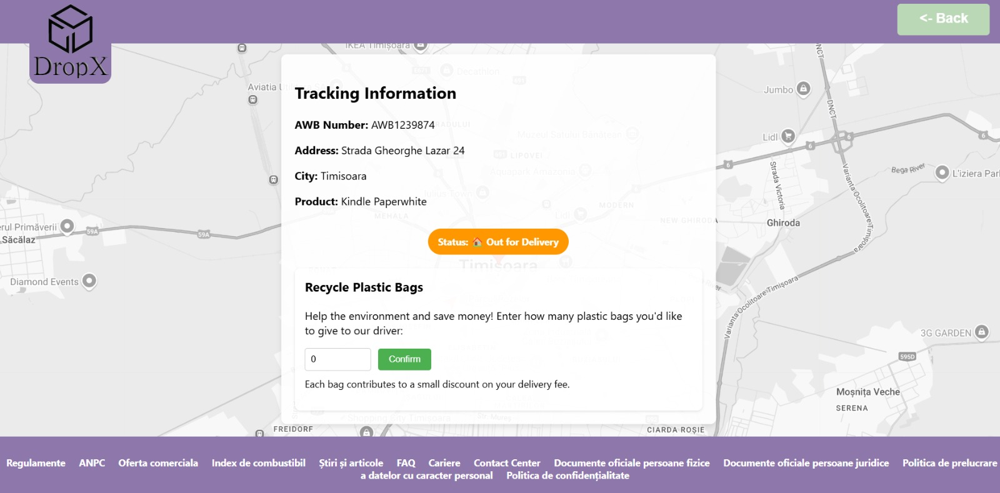
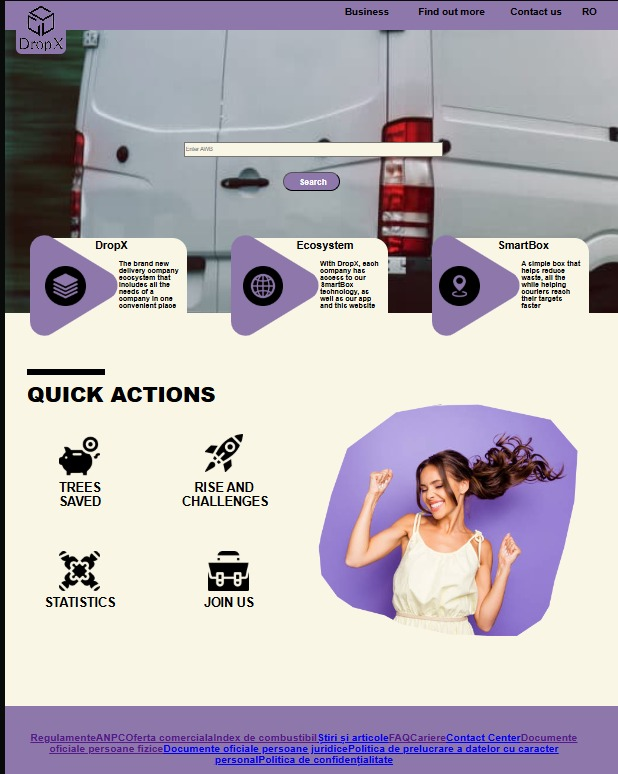

# Web app developed for DropX

## 🚀 Overview
#### This part of the project is a Web based application that is integrated with Firebase. It was made with React, HTML, CSS, it provides a user-friendly UI where users can input the AWB of their package and track it as it is delivered.

## 🖼️ Final Prototype using Web app

    

#### The website is structured into several pages. The main page allows you to travel to all of them but it is centered on getting the package specifications.

    

#### The other pages are centered around information about out company. 

    

